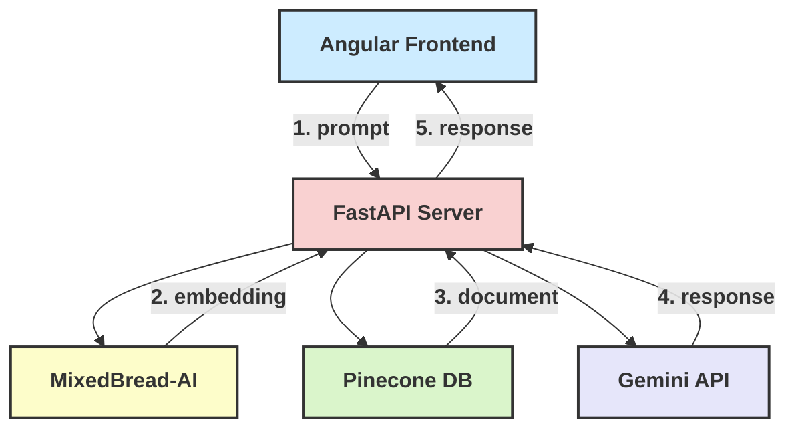

# MLChat: A Learning Platform :honeybee:

Try out MLChat at [MLChat.chat](https://mlchat.chat)

Official submission for Google AI Hackathon on [DevPost](https://devpost.com/software/mlchat)

Read the official [Medium article](https://medium.com/@msa242/mlchat-a-retrieval-augmented-generation-rag-learning-platform-4f5a5601fcff)

# Abstract

## What is the problem?

Many students studying Machine Learning turn to Large Language Models for explanations of the core concepts. Unfortunately, LLMs are prone to hallucinations and may misquote or even fabricate information. Even when they accurately explain concepts or answer a question, the information is rarely cited. Thus, students are left feeling unsure about the material and have a hard time connecting the concepts.

## Why is this problem worth solving?

A system that provides answers grounded in truth is inherently more helpful than one that generates answers in a vaccum. Additionally, learning is naturally improved by connecting questions directly to textbook material. Drawing on the concept of external cognition, students benefit greatly from relating information to the literature.

## Solution

MLChat is a learning platform that uses Retrieval Augmented Generation to answer machine learning questions with direct references to textbook material

# Introduction

This documentation serves as a development guide for the [MLChat](https://angular-frontend-y4ofhpglzq-wl.a.run.app/) learning platform, from the data engineering step to deployment, as well as a narrative account of my experience building the application. All of the application code is publicly available on the project repository. The implementation of this application is modular by design, meaning that it can easily be adapted to serve as an RAG application for any knowledge base with minimal effort.

# System Design

The RAG system connects an Angular frontend, a simple FastAPI backend, and 3 (free within very generous limits) APIs.



When the user submits a query to the server, the text content is sent to the mixedbread-ai API, which returns an embedding. This embedding is used to query the Pinecone vector database, which returns a textbook excerpt that is most relevant to the query. The textbook excerpt, the query, and the chat history are fed into the Google Gemini API to generate a response, which is finally sent back to the user.

Details on component-wise implementations are provided in individual sections below.

# Constructing the Knowledge Base

The knowledge base contains chapters from the following resources:

- [Math For Machine Learning](https://mml-book.github.io/book/mml-book.pdf)
- [Stanford CS229 Notes](https://cs229.stanford.edu/notes2022fall/main_notes.pdf)
- [The Elements of Statistical Learning](https://hastie.su.domains/ElemStatLearn/printings/ESLII_print12_toc.pdf)
- [Deep Learning](https://www.deeplearningbook.org/)

I had originally also included content from [An Introduction to Statistical Learning](https://www.statlearning.com/), but had to remove it so as to not exceed the free database tier on Pinecone.

## ETL Pipeline

The textbook material was converted into a vector database via this ETL pipeline. Each document entry in the vector database is a 500-token chapter chunk follows the format:

```python
id, embedding, content, textbook, chapter
```

1. Manually create a JSON-format specification of textbooks, chapters, and page spans

```json
{
    "Deep Learning":{
        "authors": ["Ian Goodfellow", "Yoshua Bengio", "Aaron Courville"],
        "year": 2016,
        "chapters": [
            {
                "5": [113, 158]
            },
            ...
        ]
    },
    ...
}
```

1. Load each textbook from the path specified in `.env` as a pdf via LangChain loader.

```bash
#.env
TEXTBOOK_DIRECTORY = "... /Textbooks/Machine Learning"
DATA_DIRECTORY = "... /Data"
```

1. Use the pylatexenc library to transform unicode characters into latex code
2. Save the relevant chapters into individual chapter files within separate textbook folders as plain text

With the exception of the Deep Learning textbook, which I manually copied from the publicly available HTML mirror, as the pdf is not publicly available. 

## Document Splitting

Rather than manually separating the textbook content into 500-token chunks, I used LangChain’s `TokenTextSplitter`, resulting in 522 individual chunks. Following the format from the ETL step, I saved the chunks into a JSON file. 

Note that manually creating the document chunks would lead to cleaner data and, in turn, more accurate responses. However, this is infeasible for systems with “Big Data”-scale knowledge bases. Thus, I set up the chunking pipeline for the sake of scalability.

# Embeddings Model

I decided to use mixebread.ai’s `mxbai-embed-large-v1` as it’s ranked at #12 on the MTEB leaderboard and has an easy to work with API. I’ve also talked with the CEO, who seems like a nice guy.

```python
mxbai = MixedbreadAI(api_key=MIXEDBREAD_API_KEY)

def get_embeddings(mxbai, queries):
    res = mxbai.embeddings(
        model='mixedbread-ai/mxbai-embed-large-v1',
        input=queries,
        normalized=True,
        encoding_format='float',
        truncation_strategy='start'
    )

    embeddings = np.array([res.data[i].embedding for i in range(len(res.data))])
    return embeddings
```

As an initial experiment, I performed basic semantic similarity ranking within a group of 5 document embeddings from distinct topic groups. I was happy with the results, so I proceeded to the next step.

# Vector Database

After researching various vector databases, I settled on using Pinecone due to its shockingly simple setup and API. 

Set up the database:

```python
from dotenv import load_dotenv
import os
import json
import pandas as pd
from pinecone import Pinecone, ServerlessSpec

load_dotenv()
PINECONE_API_KEY = os.getenv('PINECONE_API_KEY')
DATA_DIRECTORY = os.getenv('DATA_DIRECTORY')

INDEX_NAME = os.getenv('INDEX_NAME')
CLOUD = os.getenv('CLOUD') or 'aws'
REGION = os.getenv('REGION') or 'us-east-1'

pc = Pinecone(api_key=PINECONE_API_KEY)
spec = ServerlessSpec(cloud=CLOUD, region=REGION)

if INDEX_NAME not in pc.list_indexes():
    pc.create_index(
        INDEX_NAME,
        metric="dotproduct",
        dimension=1024, #d=1024
        spec = spec
    )
index = pc.Index(INDEX_NAME)
```

Upsert the data:

```python
data = pd.read_csv(os.path.join(DATA_DIRECTORY, 'data.csv'))
data['embedding'] = data['embedding'].apply(lambda x: json.loads(x))
to_insert = data.apply(lambda row: (row['id'], row['embedding'], {"content": row['content'], "textbook": row['textbook'], "chapter": row['chapter']}), axis=1).tolist()
index.upsert(vectors=to_insert)
```

We can now query the database by semantic similarity:

```python
def query_pinecone(query, top_k=1):
    embedded_query = get_embeddings([query]).tolist()
    return index.query(vector=embedded_query, top_k=top_k, include_metadata=True)

response = query_pinecone("What is the difference between soft-margin and hard-margin SVM?")
print_response(response)
```

# Generative Model

I’m using the Gemini API, as they provide a free API key for the Google AI hackathon.

Set up the API:

```python
import google.generativeai as genai

load_dotenv()
GEMINI_API_KEY = os.getenv('GEMINI_API_KEY')

genai.configure(api_key=GEMINI_API_KEY)
model = genai.GenerativeModel('gemini-pro')
```

Query:

```python
prompt = f"""
...{machine_learning_question},
... {textbook_content},
"""

response = model.generate_content(prompt)
print(response.text)
```

Alternatively, you can use the cloudflare API, which contains many open-source LLMs.

# Generating Responses

Embed the user query, query the database for the top $k=1$ most relevant documents, have the generative model generate a response with a hyperlink to the original document. 

## Prompt Format

```python
response = model.generate_content(prompt, 
												generation_config=genai.types.GenerationConfig(temperature=0))
```

Following DeepLearningAI’s prompting format, the language model is fed system instructions, the conversation history with user roles, and the current prompt with a relevant textbook document. Through experimentation, I’ve observed that the following changes to the system instructions lead to more consistent and helpful output:

1. Avoiding verbose instructions
2. One-shot prompting with a single output example
3. Setting up a clear if-else hierarchy
4. Instructing the model on how to handle unexpected input, including unrelated questions and small talk

Following these heuristics, I’ve achieved the best output using the following prompt format:

```python
system_instruction = """
    You are my Machine Learning tutor. Please help me answer my questions.
    
    I will provide an excerpt from a textbook along with each question. If the included textbook content is relevant to the material in the question, YOU MUST CITE THE CHAPTER in the format
    `textbook_name Chapter chapter_number`. For example, "Deep Learning Chapter 5" or "Read more in Stanford CS229 Chapter 9" etc. 
    Additionally, consider including a direct quote from it as part of your explanation. Feel free to elaborate on the topic and provide additional context. 
    Else, if the user is asking a machine learning question and the included textbook content is COMPLETELY irrelevant to their question, you MUST use this format: 
    `Unfortunately, I can't find an answer for this question in my knowledge base. I will make my best attempt to answer per my pre-training knowledge.` And then provide your best answer.
    
    However, if the user is not asking a new question, just asking for clarification on a previous question, you do not have to follow the above format and you can ignore the excerpt.
    Alternatively, if the user is not asking a question, just making conversation, you do not have to follow the above format and you can ignore the excerpt.

    Ignore the 'Assistant' and 'User' prefixes. Do not format the answer in markdown.
    """
    
prompt_template = """
    Prompt: {query}
    
    If the prompt is about machine learning or math, here is a textbook excerpt from {textbook} Chapter {chapter} that may be relevant: 
    ```
    {textbook_content}
    ```
    If it is relevant, you must cite it. If the prompt is not about machine learning or math, you can ignore the excerpt and answer accordingly.
    """
```

I’ve also set the temperature to $0.05$ for reproducible output. This hyperparameter may be changed in the future but I prefer the deterministic nature of a low-temperature system.

# Backend

The FastAPI server is separated into 3 files: main.py, config.py, utils.py. It has a single POST request endpoint that receives a prompt string and chat history object, creates an embedding of the prompt from the mixedbread-ai API, retrieves a relevant document from the Pinecone database, and sends the concatenated chat history, prompt, and document to the Gemini API to generate a response.

# Frontend

The frontend is built in Angular, using the Chat component from the Nebular UI library and the Ant Design NG-ZORRO library for everything else. The pdf view component uses the pdf2viewer npm library. 

# Deployment

The frontend and backend are uploaded on Google Cloud Run as two separate Docker images, built and deployed using the following commands:

```bash
# Frontend
gcloud builds submit --tag gcr.io/[PROJECT ID]/angular-frontend .
gcloud run deploy angular-frontend --image gcr.io/[PROJECT ID]/angular-frontend --platform managed --region us-west2 --allow-unauthenticated
```

```bash
# Backend
gcloud builds submit --tag gcr.io/[PROJECT ID]/fastapi-server .
gcloud run deploy fastapi-server --image gcr.io/[PROJECT ID]/fastapi-server --platform managed --region us-west2 --allow-unauthenticated
```

The Dockerfiles and other configurations are available in the project repositories.

# What’s Next?
In its current state, MLChat is ready to serve students around the world, providing accurate answers with relevant textbook material. Of course, there is always room for improvement.

MLChat uses a knowledge base consisting of plain-text documents with Latex-encoded symbols. This knowledgebase was created using an ETL pipeline that automatically separated documents into 500-token chunks, some of which separated paragraphs unevenly. I will improve this pipeline to cleanly separate documents into chunks, resulting in more accurate and relevant responses. Afterwards, I hope to deploy it as a standalone application, enabling developers to easily create their own RAG tutor with their documents.

MLChat, as an information retrieval system, generates useful data that can be used to perform analytics, improve its performance, and train further models. Thus, there is great value in adding user feedback functionality and developing an analytics pipeline.
